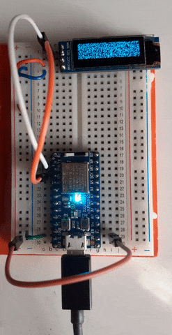

### SSD1306 OLED WHITE NOISE

Based on an example from https://github.com/jamwaffles/ssd1306

Ported to Adafruit ItsyBitsy nRF52840 Express.

Sends random raw data to the display, emulating an old untuned TV. 
Retrieves the underlying display properties struct and allows calling of the low-level `draw()` method,
sending a 512 byte buffer (128x32 pixel SSD1306) straight to the display.



### HOW TO FLASH:

* build the code: ```cargo build --release```
* convert to .hex file: ```arm-none-eabi-objcopy -O ihex target/thumbv7em-none-eabihf/release/whitenoise whitenoise.hex```
* create a dfu package: ```adafruit-nrfutil dfu genpkg --dev-type 0x0052 --application whitenoise.hex whitenoise.zip```
* put the board into bootloader mode (double click on reset button, will show up as _ITSY840BOOT_ or similar)
* flash the firmware: ```adafruit-nrfutil dfu serial --package whitenoise.zip -p /dev/ttyACM0 -b 115200```
